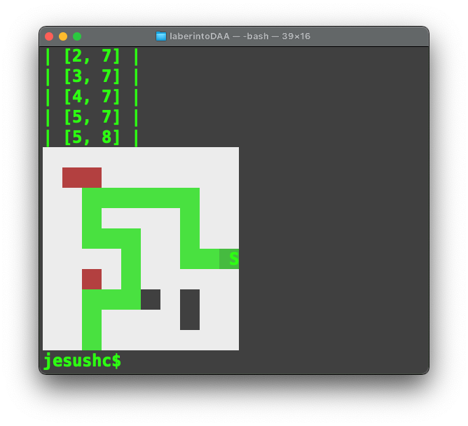

# Soución de laberinto con BackTracking

## La complejidad del código que hace backtracking es:
1 + 2n + 2x + 2y + 2z 
  

## Instalación:
- Requiere de la Instalación del paquete [colored](https://pypi.org/project/colored/)
- Requiere una terminal linux  ANSI/VT100, en windows funciona con emulador BASH de git. (GitBash)
- Se debe crear el archivo con extensión .lab que tiene los datos del laberinto de entrada.
- se ejecuta de la manera:

```
$py backtraking_p_a_p.py
```
## Salida

